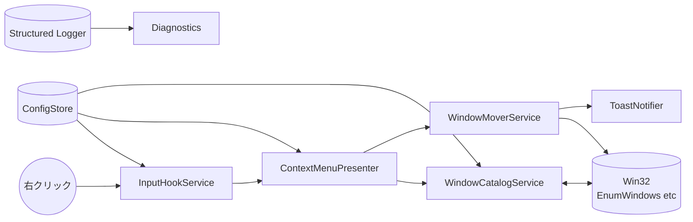
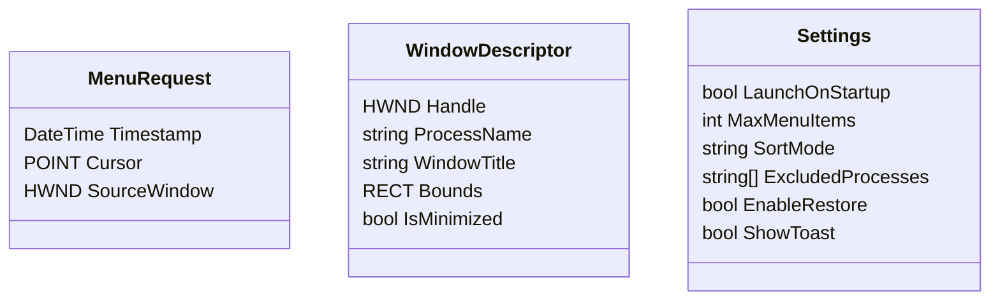
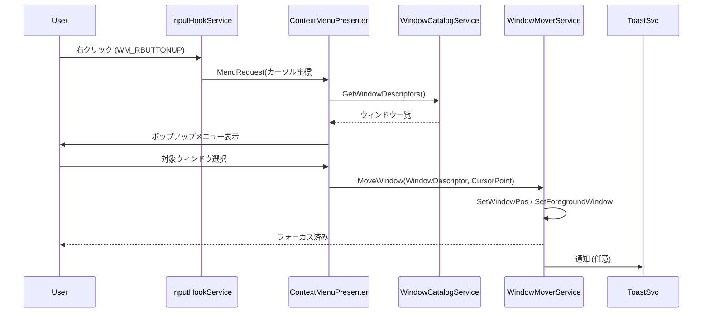

# Windows右クリックウィンドウサーフェスアプリ 設計書

## 1. 目的と適用範囲
本資料は要件定義書（`docs/requirements.md`）を踏まえ、.NET 8 / .NET MAUI (Windows) で実装する常駐型右クリックウィンドウサーフェスアプリのシステム設計と、Swift / AppKit で実装する macOS 版の構成をまとめる。リポジトリ直下では Windows 実装を `win/`、macOS 実装を `mac/` に配置する。主に以下を対象とする。
- アーキテクチャ・モジュール構成
- 主要コンポーネントと責務
- データモデル、ワークフロー、エラーハンドリング
- 技術的判断とリスク

## 2. 全体像
アプリはユーザーセッションに常駐する単一プロセスで、右クリック入力の低レベルフックを通じてコンテキストメニューを提示し、選択されたウィンドウを現在のカーソル位置のディスプレイへ移動させる。UIは表示せず、`TrackPopupMenu` ベースのネイティブメニューとトースト通知のみを使用する。

## 3. 技術選定と前提
- **アプリ基盤**: .NET MAUI Single Project (.NET 8) をベースにし、`Platforms/Windows` で WinUI 3 + Win32 API 呼び出しを行う。
- **右クリック検知方式**: `SetWindowsHookEx(WH_MOUSE_LL)` による低レベルマウスフックを採用。任意座標の右クリックを捕捉し、既存メニュー表示を阻害しないよう `CallNextHookEx` を適切に呼び出す。
- **メニュー表示**: Win32 `CreatePopupMenu` / `TrackPopupMenuEx` を利用し、マウス位置にメニューを表示。MAUI の XAML ページは使用せずネイティブ表示のみ。
- **ウィンドウ操作**: `EnumWindows` + `IsWindowVisible` + `GetWindowText` で対象を列挙し、`SetWindowPos` で移動・最前面化する。`MonitorFromPoint` でカーソル所属ディスプレイを判定。
- **常駐**: Windows スタートアップ登録はレジストリ (`HKCU\Software\Microsoft\Windows\CurrentVersion\Run`) にショートカットを作成。

## 4. モジュール設計

### 4.1 InputHookService
- **責務**: グローバル右クリックを捕捉し、アプリ独自のメニュー表示トリガーを送出。
- **処理**:
  1. プロセス起動時に `SetWindowsHookEx(WH_MOUSE_LL, ...)` を登録。
  2. `WM_RBUTTONUP` を検知すると現在のカーソル座標とウィンドウハンドルを `MenuRequest` として通知。
  3. 除外プロセスや管理者権限ウィンドウはフック内で判定しスキップ。
- **エラー時**: フック登録失敗はリトライし、ダメな場合はログ出力とユーザー通知。

### 4.2 ContextMenuPresenter
- **責務**: `MenuRequest` を受け、ウィンドウ一覧を取得・整形したポップアップメニューを表示。
- **機能**:
  - 最大表示件数、並び順（最近アクティブ順/アルファベット）の設定に対応。
  - メニュー項目ラベルは `アプリ名 | ウィンドウタイトル` とし、視認性向上のため幅制限と省略記号を適用。
  - 項目選択時に `WindowSelection` イベントを発火。

### 4.3 WindowCatalogService
- **責務**: 列挙可能なウィンドウを取得・キャッシュし、`WindowDescriptor` リストを返す。
- **詳細**:
  - `EnumWindows` + `EnumChildWindows` でトップレベルのみを対象。
  - プロセス名・アイコン取得に `GetWindowThreadProcessId` + `QueryFullProcessImageName` を利用。
  - 除外リスト（設定ファイル）に一致するウィンドウは除去。
  - キャッシュは100ms以内返却を目標に、最終列挙時刻と比較して更新。

### 4.4 WindowMoverService
- **責務**: 選択ウィンドウを右クリック座標ディスプレイへ移動し、最前面化・フォーカスを付与。
- **手順**:
  1. `MonitorFromPoint` で対象モニタのワークエリアを取得。
  2. ウィンドウサイズを `GetWindowRect` で確認し、ワークエリア中央に座標を算出。
  3. `SetWindowPos(HWND_TOPMOST)` → `SetWindowPos(HWND_NOTOPMOST)` で一時的に最前面化。
  4. `SetForegroundWindow`、必要に応じて `AttachThreadInput` でフォーカスを移動。
  5. 旧座標を保持し、F-05 の元位置復元に備える。

### 4.5 ConfigStore / SettingsProvider
- JSON ベースの設定ファイル（`%AppData%\MagPrime\settings.json`）を作成。
- 項目例: `StartupMode`, `MaxMenuItems`, `SortMode`, `ExcludedProcesses`, `ShowToast`.
- `IOptionsMonitor` 風にホットリロード可能にして変更即時反映。

### 4.6 Logging & Diagnostics
- `Microsoft.Extensions.Logging` の構成を流用し、`Serilog` もしくは `EventLog` 出力を想定。
- デバッグビルドでは詳細ログ、リリースではWarning以上を記録。

## 5. データモデル

- `WindowDescriptor` は `WindowCatalogService` と `ContextMenuPresenter` 間のDTO。
- 選択後は `SelectionContext` として旧座標や前回モニタIDを保持し、復元機能で利用する。

## 6. ワークフロー詳細

## 7. エラーハンドリング / 例外設計
- フック設定失敗: リトライ（指数バックオフ）後にユーザーへトースト通知。以降はメニュー機能を無効化しログに記録。
- UAC / 管理者権限ウィンドウ: 権限不足時は `AllowSetForegroundWindow` を試行し、失敗した場合は「移動不可」メッセージを表示。
- ウィンドウ列挙エラー: タイムアウトやアクセス拒否は対象をスキップし、メニュー項目に警告アイコンを付与する案を検討。

## 8. パフォーマンス設計
- 右クリック発生からメニュー表示まで100ms以内を目標に、ウィンドウ一覧は常時バックグラウンドで更新しメインスレッドではキャッシュ参照。
- `WindowCatalogService` は `Task.Run` + `CancellationToken` で非同期更新し、結果をスレッドセーフな `ConcurrentDictionary` に格納。
- GC プレッシャーを抑えるため、`WindowDescriptor` はプールで再利用。

## 9. テスト方針
- **ユニットテスト**: ウィンドウフィルタリング、設定読み書き、メニュー整形ロジックを `xUnit` で検証。
- **統合テスト**: WinAppDriver や自動化が難しいため、専用デバッグUI（開発時のみ）で擬似ウィンドウを生成し手動確認。
- **負荷テスト**: 100+ ウィンドウ保持時のメニュー表示遅延を測定。
- **回帰テスト**: 主要API呼び出しをラップする `IWin32Interop` をモック化し、シミュレーション可能にする。

## 10. リスクと対応
| リスク | 影響 | 緩和策 |
|--------|------|--------|
| 低レベルフックがセキュリティソフトでブロック | 機能停止 | デジタル署名、コードサイニング、ホワイトリスト手順をドキュメント化 |
| 管理者権限のウィンドウにフォーカスできない | UX低下 | ユーザーに昇格起動オプションを提示し、失敗時にメッセージ表示 |
| MAUI + WinUI の更新による API 変更 | 保守コスト | 対象バージョンを固定しCIでビルド検証 |
| 多言語環境で文字化け | メニュー視認性低下 | Unicode API (Wide char) を使用し、フォントのフォールバックを確認 |

## 11. 今後の課題
1. シェル統合（エクスプローラー拡張）アプローチとの比較検証。
2. 自動アップデータ（MSIX / Winget）採用可否。
3. 操作ログの匿名化・保管期間ポリシー策定。

## 12. macOS 版 (Swift/AppKit) アーキテクチャ
- **基盤**: Swift 5.9 + AppKit (SwiftPM executable)。バックグラウンドのアクセサリアプリとして起動し、`NSApplication` のメインループ上で常駐。
- **右クリックフック**: `CGEventTap` (`kCGEventRightMouseUp`) を低レベルで監視し、発火時に `MenuRequest` を生成。アクセシビリティ権限なしでもフックは動作するが、ウィンドウ操作には別途権限が必要。
- **メニュー表示**: `NSMenu.popUp(positioning:at:in:)` を用いてマウス座標にネイティブメニューを同期表示。Windows 版と同じ `MaxMenuItems` / 並び替え設定を使用。
- **ウィンドウ列挙**: `CGWindowListCopyWindowInfo` でオンスクリーンのウィンドウ情報を列挙し、`ownerName` と `kCGWindowName` を整形して `WindowDescriptor` として保持。`ExcludedApps` としてプロセス名フィルターを適用。
- **ウィンドウ移動**: `AXUIElement` API で対象アプリのウィンドウを特定し、`kAXPositionAttribute` / `kAXSizeAttribute` を更新する。マウス座標が含まれる `NSScreen.visibleFrame` の中心へ移動し、`NSRunningApplication.activate` でフォーカスを移動。
- **通知**: `NSUserNotificationCenter` (ローカル通知) でフィードバックを提示。設定の `ShowToast` フラグに連動。
- **構成要素**: `BootstrapService` が Windows 版と同等の責務で各サービスを束ね、設定は `~/Library/Application Support/MagPrime/settings.json` に保存する `SettingsProvider` が提供。

以上。
