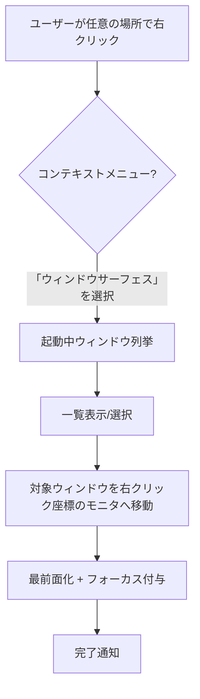

# Windows右クリックウィンドウサーフェスアプリ 要件定義書

## 1. 概要
マルチディスプレイ環境で右クリックメニューから起動中ウィンドウを一覧し、選択したウィンドウを右クリック位置へ瞬時に移動させる常駐型ユーティリティを開発する。UIを持たず、任意の位置で右クリックした際に表示されるコンテキストメニューのみで操作する。

## 2. 目的とゴール
- 画面の一部が他用途で占有されていても、見えなくなったアプリを素早く操作可能にする。
- 右クリックから直感的に全ウィンドウを俯瞰し、任意のディスプレイ上へ再配置できるようにする。
- 背景常駐でもシステム負荷を最小化し、働き方を阻害しない。

## 3. 対象ユーザーと利用シナリオ
- **対象ユーザー**: マルチディスプレイで作業し、画面を頻繁に切り替えるオフィスワーカー／クリエイター。
- **主シナリオ**:
  1. ユーザーが任意の場所で右クリック。
  2. 本アプリのコンテキストメニューが表示され、稼働中ウィンドウの一覧を提示。
  3. 選択したウィンドウを右クリック箇所のディスプレイ・座標へ移動し、直ちにフォーカスを与える。

## 4. 前提・制約
- 対象OS: Windows 11/10 (64bit)、macOS 13 Ventura 以降。
- 技術スタック: Windowsは .NET 8 + .NET MAUI、macOS は Swift 5.9 + AppKit。
- UIは常駐アイコンを持たず、右クリックコンテキストメニューのみで操作。
- 外部システム連携は不要。
- マルチモニタ環境での座標取得・ウィンドウ管理に Win32 API / CoreGraphics + Accessibility API を併用。

## 5. 機能要件
| ID | 要件 | 詳細 |
|----|------|------|
| F-01 | 常駐起動 | Windowsログオン時に自動起動し、バックグラウンドサービスとして動作する。|
| F-02 | グローバル右クリックフック | 任意の画面座標で右クリック発生時にコンテキストメニューへエントリを挿入する。|
| F-03 | ウィンドウ一覧取得 | 最前面・最小化含むユーザーアプリウィンドウを列挙し、アプリ名＋ウィンドウタイトルを表示。|
| F-04 | ウィンドウ可視化 | 選択されたウィンドウを最前面化し、右クリック位置のディスプレイ中央付近へ移動。|
| F-05 | 元位置復元(任意) | オプションで元のモニタ位置へ戻すトグルを提供。|
| F-06 | 設定 | 起動時動作、ホットキー有効/無効、除外アプリリストなどを設定ファイルで管理。|
| F-07 | ログ出力 | 主要操作とエラーをローカルログに記録しトラブルシュートを容易にする。|

## 6. 非機能要件
- **性能**: ウィンドウ一覧生成は100ミリ秒以内、選択後の移動は即時体感 (<200ミリ秒)。
- **リソース**: メモリ常駐30MB以内、CPU使用率1%未満（待機時）。
- **信頼性**: 想定外のウィンドウ（UWP/管理者権限）にも影響を与えずエラー処理を行う。
- **セキュリティ**: 権限昇格を必要最小限に留め、アクティブなユーザーセッション内のみで操作。

## 7. UI/UX方針
- 右クリックメニュー項目はアプリ名＋ウィンドウタイトルで整形し、最大件数を設定可能。
- 選択時に短いトースト通知で「◯◯を右クリック位置へ移動しました」を表示してフィードバック。
- デザインガイド: Fluent Designに合わせフラットで一貫したアイコン・ラベル。

## 8. 技術スタックとアーキテクチャ
- **アプリケーション**: .NET MAUI (.NET 8) Single Project, Windows target。
- **ネイティブAPI**: Win32 (SetWindowPos, EnumWindows, GetWindowThreadProcessId, MonitorFromPoint 等)。
- **サービス構成**: 背景サービス＋グローバルフックモジュール＋ウィンドウ管理モジュール。

## 9. 未確定事項 / 次の確認
1. グローバル右クリックを横取りする具体方式（シェル拡張 vs 独自フック）をどちらで実装するか。
2. 管理者権限が必要なケースへの対応方針。
3. 除外対象とするシステムウィンドウの定義。
4. 自動更新や配布方法の要否。

以上。
